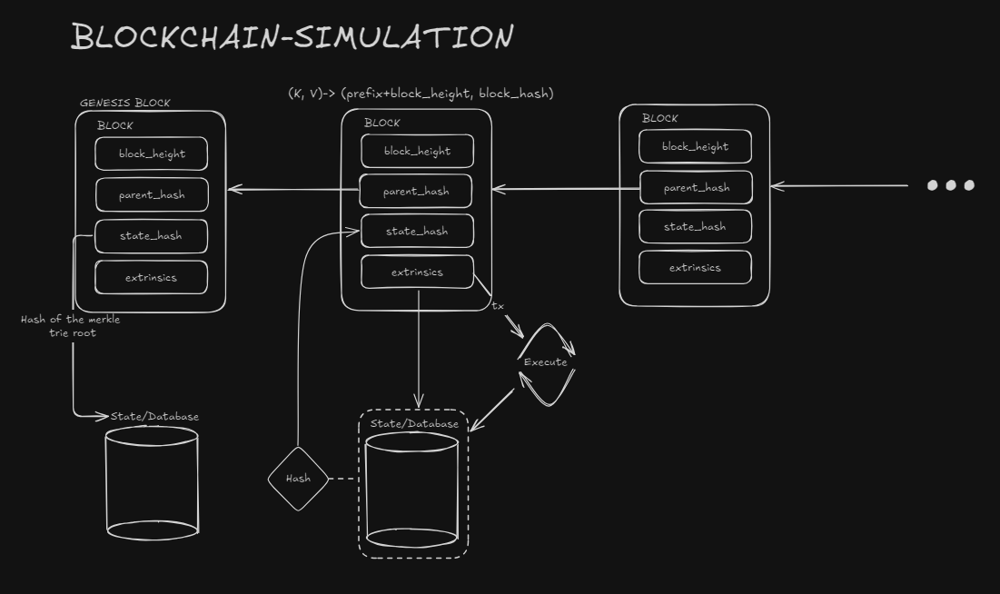

# Blockchain Simulation

## Overview

This project is a simplified blockchain simulation implemented in Rust. It aims to demonstrate the core concepts of blockchain technology, including block creation, transaction processing, consensus mechanisms, and state management.



## Features

- Block creation and validation
- Transaction processing (Transfer, Mint, Burn, Account Creation)
- Simple consensus mechanism
- State management with a key-value store
- Node simulation with transaction pools
- Basic network simulation

## Project Structure

The project is organized into a few crates, each responsible for a specific aspect of the blockchain:

- `state`: Manages the blockchain state and storage
- `node`: Simulates network nodes and transaction processing and implements the consensus mechanism
- `common`: Contains shared types and utilities

## Prerequisites
- Rust

## Setup

1. Clone the repository:
   ```
   git clone https://github.com/yourusername/blockchain-simulation.git
   cd blockchain-simulation
   ```

2. Build the project:
   ```
   cargo build
   ```

## Running the Simulation

To run the blockchain simulation:

```
cargo run
```

This will start the simulation, creating blocks, processing transactions, and demonstrating the basic functionality of the blockchain.

## Project Components

### State

The `state` crate manages the blockchain's state, including account balances and block storage. It uses a key-value store for persistence.

### Node

The `node` crate simulates network nodes, managing transaction pools and block propagation. It also contains a simple consensus mechanism for block validation and chain selection.

### Common

The `common` crate contains shared types, traits, and utilities used across the project.

## WIP

This project is still a work in progress, and still requires some elbow grease to cover most of what a blockchain does. Here are the current requirements that are missing:
- Add a fully-fledged consensus mechanism with added roolback capabilities
- Importing a block should be agnostic over the node network
- Add nonce for accounts
- State should have its own crate, with additional functionality
- Transaction processing should be fully integrated in the node layer
- Block validation should have an additional check on extrinsics root
- SignedTransaction does not currently contain cryptographic signatures and needs to be added
- Documentation incomplete
- Type aliases and constants should be added on the next refactor
